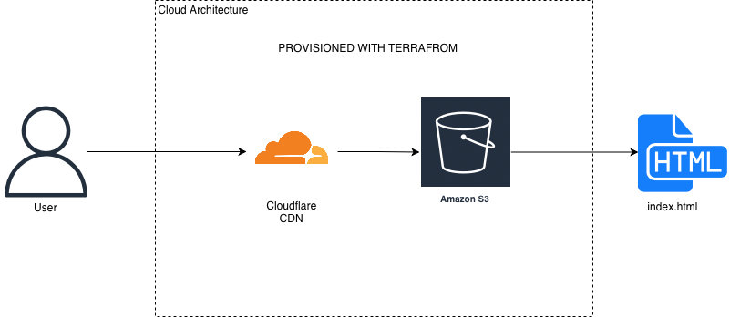

# Host a Simple Webpage with AWS S3 and Cloudflare

## Contents

- Cloud Architecture
- Prerequisite
- Install Terraform
- Create Cloudflare API Token
- Clone the repository
- Set variable values
- Apply Configuration
- Add websiet files to S3 bucket
- Cleanup

## Cloud Architecture

To host a simple webpage, AWS S3 and Cloudflare is used in this project.



## Prerequisites

- AWS Account
- Cloudflare Account
- Terraform (1.14.3) installed locally
- a domain name with nameservers pointing to Cloudflare

## Install Terraform

For installing Terraform, you can follow this [link](https://developer.hashicorp.com/terraform/tutorials/aws-get-started/install-cli)

## Create Cloudflare API Token

To create an API token, go to the [API Token](https://dash.cloudflare.com/profile/api-tokens) page in your Cloudflare account.

In the permission section,

1. Zone -> Single Redirect -> Edit
2. Zone -> Zone -> Read
3. Zone -> DNS -> Edit
4. Zone -> Page Rules -> Edit

In the Zone resources,
Include -> Specific zone -> the domain you want to manage with Cloudflare (htet-arkar.uk)

After creating token, record it somewhere safe. Create an environment variable named CLOUDFLARE_API_TOKEN and set it to your Cloudflare API token.

```bash
export CLOUDFLARE_API_TOKEN=
```

Terraform will use this environment variable to authenticate the Cloudflare Provider.

## Clone the repository

```bash
git clone https://github.com/MKhant10/Host-Simple-Webpage-AWS.git
```

## Set variable values

Copy the contents of `terraform.tfvars.example` into new file name `terraform.tfvars`

```bash
cp terraform.tfvars.example terraform.tfvars
```

Update the value of site domain to your own domain and set aws_region as you want.

**terraform.tfvars**

```hcl
aws_region = "ap-southeast-7"
site_domain = "yourdomain"
```

## Apply Configuration

Initialize the Terraform configuration

```bash
terraform init
```

```
Initializing the backend...
Initializing provider plugins...
- Reusing previous version of cloudflare/cloudflare from the dependency lock file
- Reusing previous version of hashicorp/aws from the dependency lock file
- Using previously-installed cloudflare/cloudflare v5.15.0
- Using previously-installed hashicorp/aws v6.28.0

Terraform has been successfully initialized!

You may now begin working with Terraform. Try running "terraform plan" to see
any changes that are required for your infrastructure. All Terraform commands
should now work.

If you ever set or change modules or backend configuration for Terraform,
rerun this command to reinitialize your working directory. If you forget, other
commands will detect it and remind you to do so if necessary.
```

```bash
terraform apply
```

```
## ...
Plan: 10 to add, 0 to change, 0 to destroy.

Changes to Outputs:
  + bucket_endpoint     = (known after apply)
  + domain_name         = "htet-arkar.uk"
  + website_bucket_name = (known after apply)

Do you want to perform these actions?
  Terraform will perform the actions described above.
  Only 'yes' will be accepted to approve.

  Enter a value: yes
##...
Apply complete! Resources: 10 added, 0 changed, 0 destroyed.

Outputs:

bucket_endpoint = "yourdomain.s3-website.ap-southeast-7.amazonaws.com"
domain_name = "yourdomain"
website_bucket_name = "yourdomain"
```

## Add website files to S3 bucket

Upload your index.html, error.html to S3 bucket.

```bash
aws s3 cp website/ s3://$(terraform output -raw website_bucket_name)/ --recursive
```

```
upload: website/index.html to s3://htet-arkar.uk/index.html
upload: website/logo.png to s3://htet-arkar.uk/logo.png
upload: website/error.html to s3://htet-arkar.uk/error.html
```

**Open your domain URL on the browser.**

## Cleanup

First you need to empty the bucket.

```bash
aws s3 rm s3://yourbucketname --recursive
```

```
delete: s3://htet-arkar.uk/logo.png
delete: s3://htet-arkar.uk/index.html
delete: s3://htet-arkar.uk/error.html
```

remove resources

```bash
terraform destroy
```

```
##...
Plan: 0 to add, 0 to change, 10 to destroy.

Changes to Outputs:
  - bucket_endpoint     = "htet-arkar.uk.s3-website.ap-southeast-7.amazonaws.com" -> null
  - domain_name         = "htet-arkar.uk" -> null
  - website_bucket_name = "htet-arkar.uk" -> null

Do you really want to destroy all resources?
  Terraform will destroy all your managed infrastructure, as shown above.
  There is no undo. Only 'yes' will be accepted to confirm.

  Enter a value: yes
##...
Destroy complete! Resources: 10 destroyed.
```
